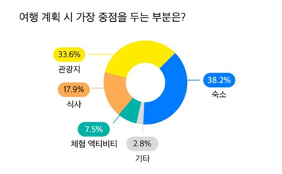
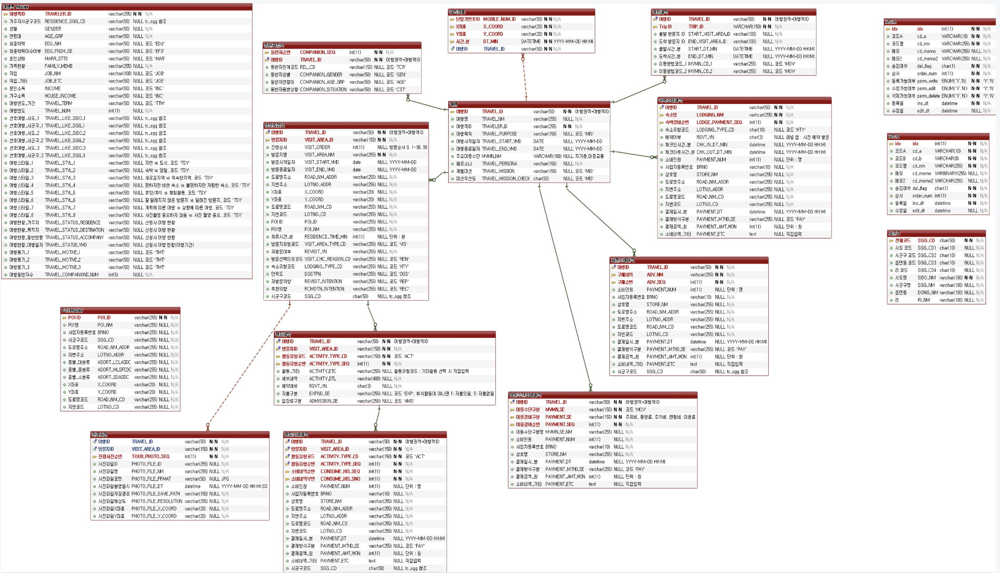
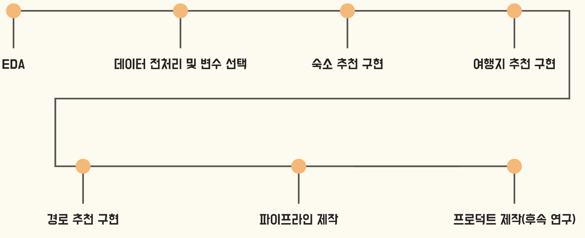

# 22_MiniProject_BBGG

### Ai허브 제주도 여행로그 데이터를 이용하여 숙소 기반 여행지 추천 및 경로 최적화

---

## 1. 프로젝트 개요

---

## 2. 사용한 데이터셋

## 3. 전체 흐름

## 4. 사용 모델 및 알고리즘

### 4.1 숙소추천

### 사용 모델 : Xgboost

#### 여행객 정보(성별, 나이, 선호여행 스타일)를 이용해 숙소 유형 출력

### 4.2 여행지 추천

### 사용 알고리즘: MF - SVD

#### 숙소유형에 맞는 유저들의 유사도 기반 여행지 추천

### 4.3 여행 경로 최적화

### 사용 라이브러리: or-tools(TSP 문제)

#### 숙소, 여행지 좌표를 받아 경로 최적화

---

## 5. 한계점 및 보완점

#### Cold start problem & 개인화 추천 시스템 불발

#### - 신규 이용자를 대상으로 하는 추천 시스템이 가지는 고질적인 문제인 항상 cold start problem을 가짐

#### - 시간상 신규 이용자에 대한 cold start problem을 해결하기 어렵기에 기존 이용자(Traveler_id)를 선정하여 추천을 진행함

## 6. 추후 계획

#### 모델 서빙 및 Cold start problem 보완

---
